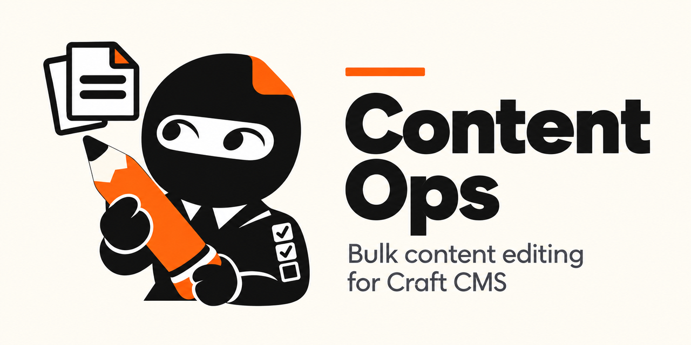

# Content Ops

Bulk edit and find & replace for Craft CMS, with preview and undo.

Change hundreds of entries in minutes, see every change before it happens, and undo it if you got it wrong.

**Free.** Every feature is included: Matrix editing, regular expressions, undo of any changeset and AI access.

## How it works

Every change goes through the same four steps:

1. **Select**: entries in an index (the selection, or everything matching the current search/filters), or everything a Find & Replace search finds.
2. **Preview**: every before → after value, per entry, site and field. Nothing is saved yet.
3. **Apply**: saved in the background as a queue job, with a normal entry revision per save.
4. **Undo**: from **Content Ops → History**, any time.

Each run is stored as a **changeset**: a log of every old and new value. That log is what makes previews exact, conflicts detectable and undo possible.

### Bulk edit

On any entry index, click **Bulk edit** in the footer (or select entries and use **Bulk edit…** in the actions menu):

- **Scope**: the selected entries, or *all entries matching the current view* (every page, including your search and filters).
- **Sites**: which sites to change (all are checked by default).
- **Changes**: pick a field, an operation and a value; stack several. Fields that only some entries have show "applies to N of M".
- **Preview** shows a before/after table (and warns about entries with drafts). **Apply** runs in the background and refreshes the list when done.

| Field type | Operations |
|---|---|
| Title, Plain Text, CKEditor | set, clear, prepend, append, find & replace, set from a pattern (`{title} – {section.name}`) |
| Slug | the same; patterns are turned into valid slugs |
| Number | set, clear, ± value, ± % (empty values stay empty) |
| Lightswitch, Enabled, Enabled for site | on, off, toggle |
| Dropdown, Radio buttons / Checkboxes, Multi-select | set, clear / set, add, remove, clear |
| Date, Post Date, Expiry Date | set, clear, shift by ± days (keeps the local time across DST) |
| Entries, Categories, Assets, Tags, Users, Authors | replace, add, remove, clear |
| Matrix | add a nested entry; remove nested entries of a type (optionally only if their text contains X) |
| Fields inside Matrix (`Matrix › Type › Field`) | all of the above, applied to each nested entry of that type |

### Find & Replace

**Content Ops → Find & Replace** searches titles, Plain Text and CKEditor fields (optionally inside Matrix nested entries too) across all sections and sites by default (uncheck “All” to pick specific ones).

- Case-sensitive, whole words, and regular expressions (`$1` in replacements; runaway patterns are stopped safely).
- In CKEditor fields only **visible text** is searched: HTML tags, reference tags (`{entry:12:url}`) and embedded entries are never touched. Optionally also replace inside `href`/`src` (e.g. moving `http://old.test` to `https://new.test`).
- Searches run in the background; you then review **every match in context** and untick the ones to keep before applying.

### History & undo

- **Undo** restores the original values. Values someone edited *after* the changeset ran are left alone ("Edited since"); **Force undo** overwrites them.
- Relations and Matrix undo only what the changeset did (removed nested entries come back with their original IDs and positions).
- If a value changed between preview and apply, that change is skipped as a **conflict**, so you never overwrite something you didn't see.
- Values shared between sites (untranslated fields, Matrix fields propagating to all sites) are changed **once**, never once per site.
- History is kept for 90 days by default (configurable); unapplied previews are removed after a day.

### Permissions

| Permission | Allows |
|---|---|
| Bulk edit elements | the Bulk edit button/action; entries the user can't save are skipped and reported |
| Find and replace | the Find & Replace page |
| Undo changesets | undo / force undo |
| View changeset history | everyone's changesets (otherwise only one's own) |

### Console

```bash
php craft content-ops/bulk-edit --section=news --field=title --op=append --value=" (2026)" [--site=*] [--apply]
php craft content-ops/find-replace --find="http://old.test" --replace="https://new.test" --links [--apply]
php craft content-ops/changesets                # list
php craft content-ops/changesets/view 12        # details
php craft content-ops/changesets/apply 12
php craft content-ops/changesets/undo 12 [--force]
```

## AI access (MCP)

Content Ops includes an [MCP](https://modelcontextprotocol.io) server, so AI tools (Claude, Cursor, …) can understand your content model, read content and **propose changes as changesets**. People stay in control: a proposal changes nothing until someone reviews it in the CP and applies it, and every change can be undone like any other.

**Connect over HTTP:** go to **Content Ops → AI Access**, create a token, and paste the config it shows into your AI tool:

```json
{
  "mcpServers": {
    "content-ops": {
      "type": "http",
      "url": "https://example.com/actions/content-ops/mcp",
      "headers": { "Authorization": "Bearer co_…" }
    }
  }
}
```

Each token acts as the user who created it, with their permissions, in one of three modes:

| Mode | The AI can |
|---|---|
| Read only | read the content model and content |
| Propose changes | also create changesets; **a person reviews and applies them** under History (the default) |
| Propose and apply | also apply and undo changesets itself, after the user confirms in the chat |

**Or locally over stdio:** `php craft content-ops/mcp [--mode=readonly|propose|full] [--as=username]`.

| Tool / resource | What it does |
|---|---|
| `get_project_schema`, `project://schema` | Sites, sections, entry types, field layouts and fields |
| `project://context` | Your notes for AI tools (Settings → AI context): tone of voice, naming rules, what not to touch |
| `search_content`, `read_entry` | Find and read entries (only those the token's user can view) |
| `get_edit_options` | What can be edited on some entries: fields, operations and their options |
| `propose_bulk_edit`, `propose_find_replace` | Create a previewed changeset (nothing is saved) and return sample changes plus a review link |
| `get_changeset`, `list_changesets` | Inspect proposals and history |
| `apply_changeset`, `undo_changeset` | Only in “Propose and apply” mode |

AI proposals are marked **AI · token name** in the History, which has an **AI proposals awaiting review** filter, and the Content Ops menu shows how many are waiting. Proposals are limited in size (Settings → Max items per AI changeset) and tokens are rate-limited. Tokens are stored as hashes and can be revoked any time.

## Requirements

Craft CMS 5.11.0 or later, PHP 8.2 or later.

## Installation

From the Plugin Store: search for “Content Ops” and press “Install”. Or with Composer:

```bash
composer require romanavr/craft-content-ops
php craft plugin/install content-ops
```

## Development

Development happens against the DDEV sandbox in `../sandbox`. From the sandbox directory:

```bash
ddev pest                                          # tests (plugin/tests), run against the sandbox's `test` database
ddev exec -d /var/www/plugin composer check-cs     # ECS
ddev exec -d /var/www/plugin composer phpstan      # PHPStan (level 5)
```
